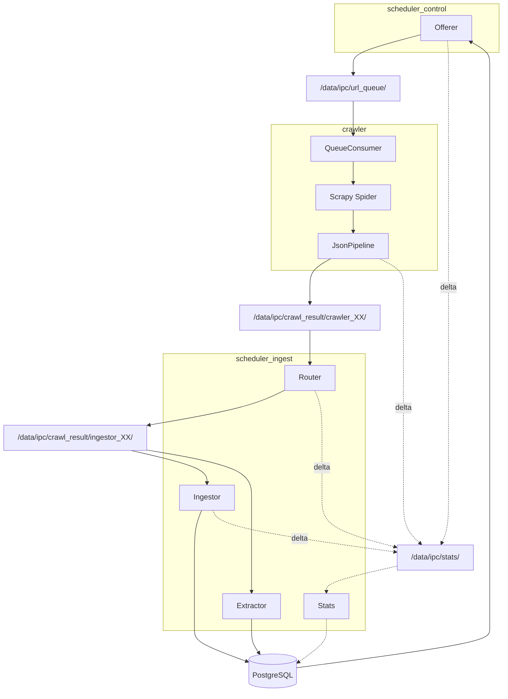
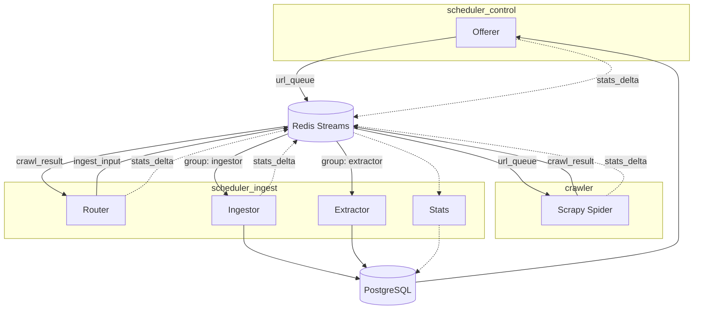

# 06. IPC Backend Comparison

## Before: Filesystem IPC



## After: Redis Stream IPC (feature flag)



## Comparison

| | Filesystem | Redis Stream |
|---|---|---|
| Produce | 3,002 msg/sec | 3,716 msg/sec (+24%) |
| Consume | 3,847 msg/sec | 18,692 msg/sec (+386%) |
| E2E latency p50 | 4.64 ms | 1.03 ms (4.5x) |
| Pipeline delay | 20+ min (folder wait) | < 1 sec |
| Delivery guarantee | Read-and-delete, crash loses data | ACK-based, crash safe |
| Consumer groups | N/A, Ingestor and Extractor read same files sequentially | Independent groups on same stream |
| Monitoring | None | XINFO GROUPS for consumer lag |
| Cleanup | Manual, ingestor_XX never deleted | Automatic retention |
| Extra dependency | None | Redis container |

## How to Switch

Config-based feature flag in `libs/ipc/bus.py`:

```yaml
# Filesystem (default, no extra deps)
ipc:
  backend: "filesystem"
  base_dir: "/data/ipc"

# Redis (requires pip install webcrawler[redis])
ipc:
  backend: "redis"
  url: "redis://redis:6379/0"
```

```python
from libs.ipc.bus import create_producer, create_consumer

producer = create_producer(config["ipc"])
consumer = create_consumer(config["ipc"], group="router", consumer_name="router_00")
```
